## Hotel Booking App

Hotel Booking app made with Flutter and Firebase

## Development Setup

Register in Razor Pay and get a test key,

Add the key at 

```
/lib/controllers/confirmation_controller.dart/line 153
```

Clone the repository and run the following commands:
```
flutter pub get
flutter run
```

## Screenshots

### Onboard Page
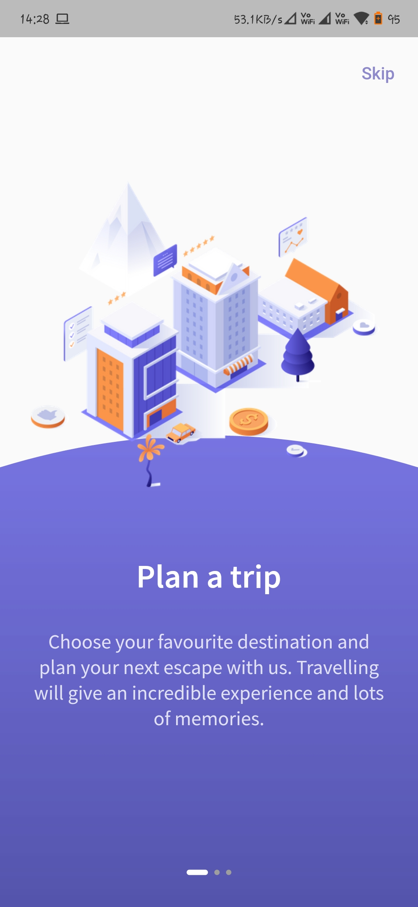 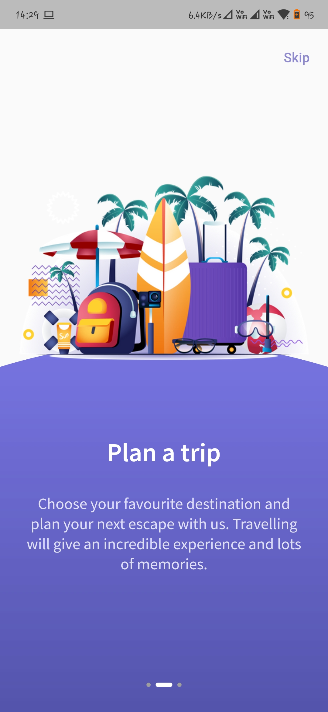 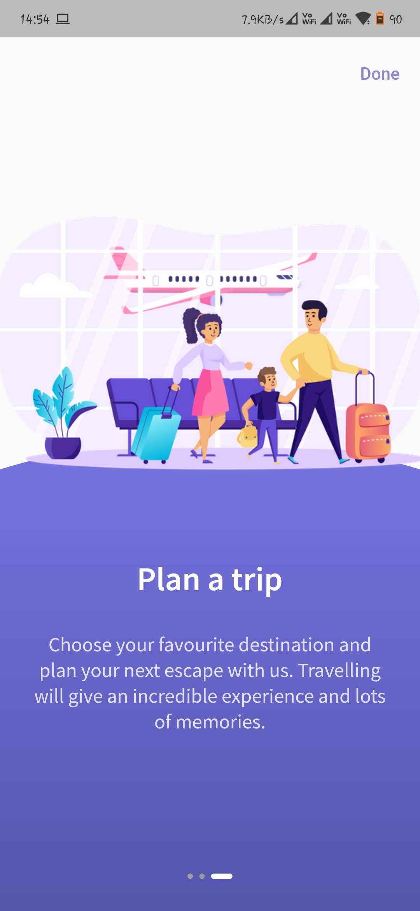

### Login and Register
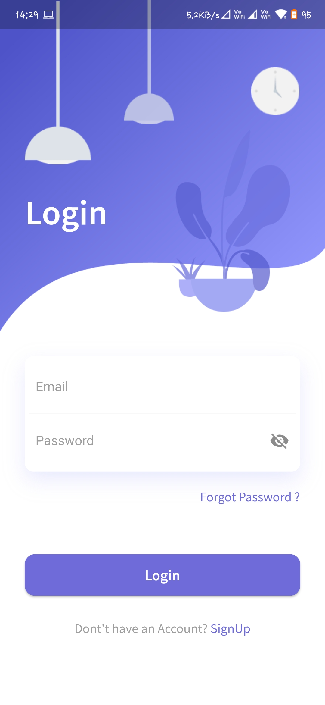 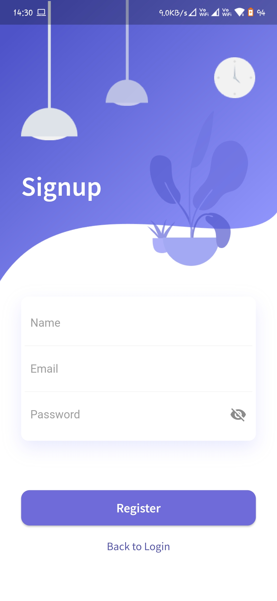

### Home Page
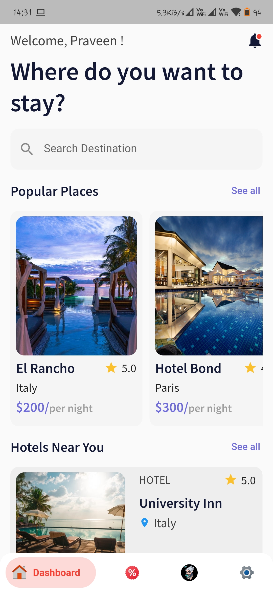 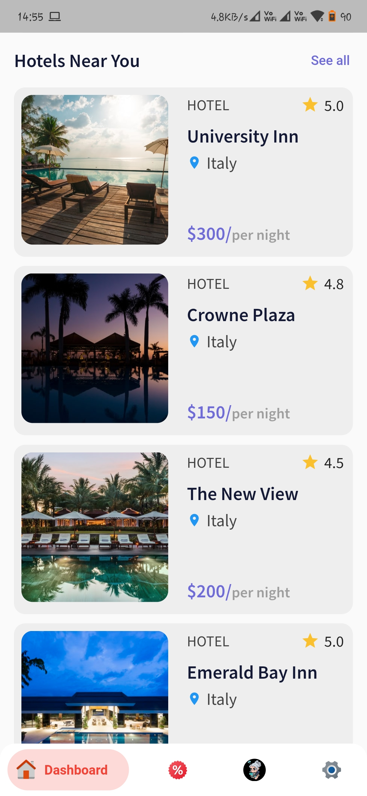

### Hotel View Page
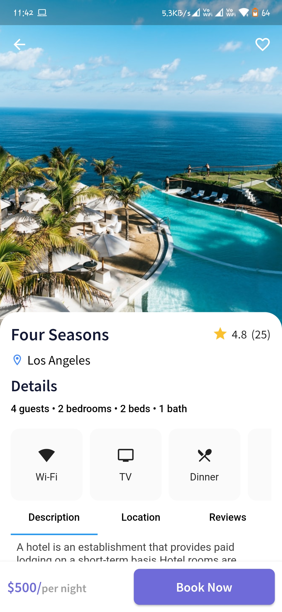

### Confirmation Page
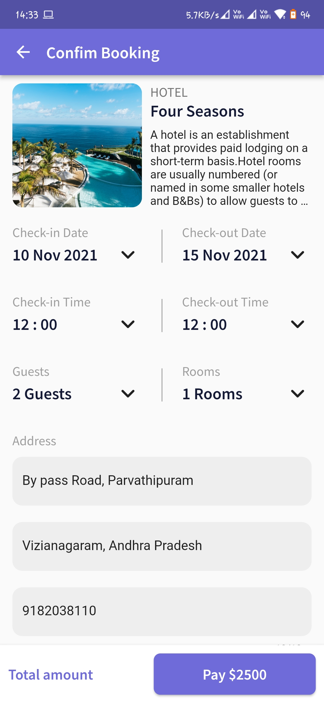

### My Bookings
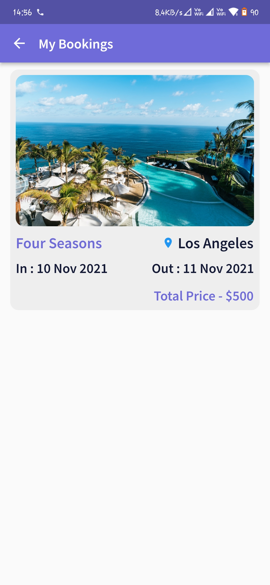

### Profile Page
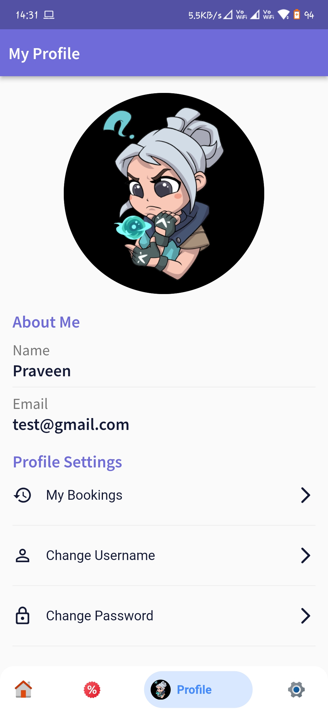

### Settings Page
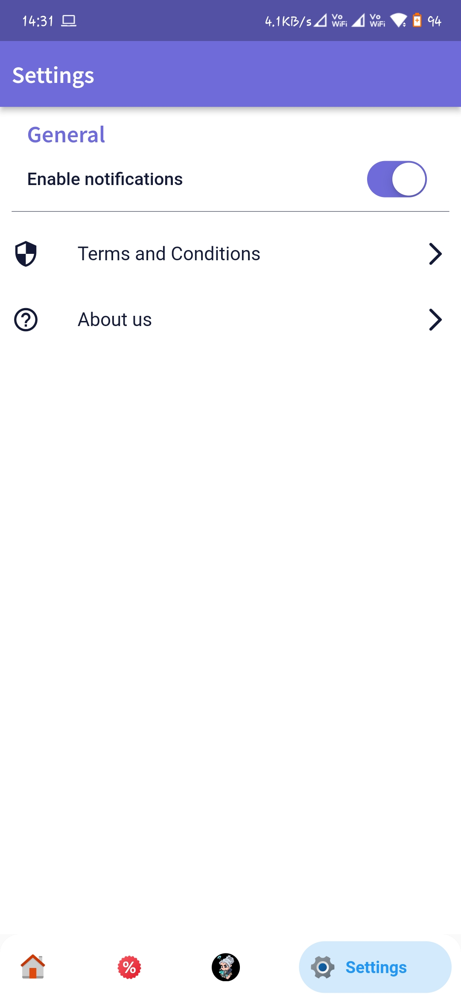

### View Profile 


### Payment Page
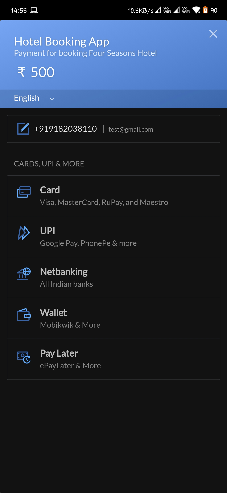

### Notifications Page
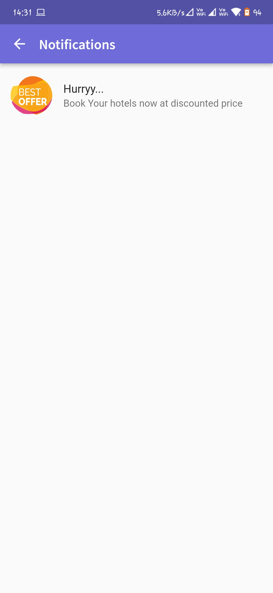

### Offers Page
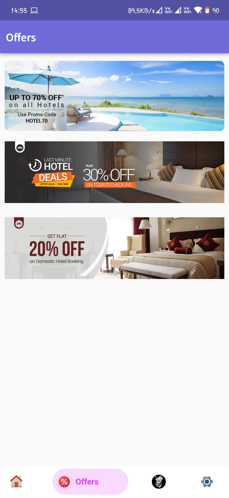

### Reset Password Page
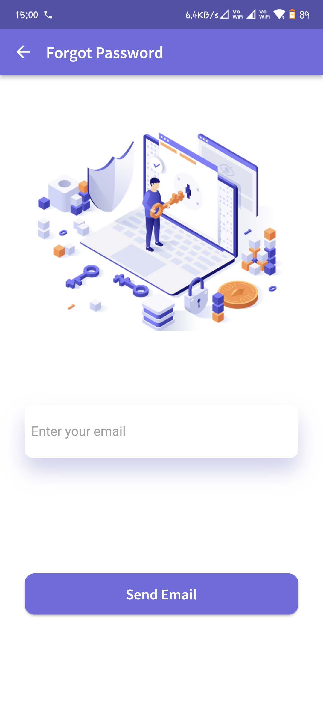


## Links

* [Linkedin](https://www.linkedin.com/in/praveen-kumar-593597200/)
* [Instagram](https://instagram.com/praveen_gongada)
